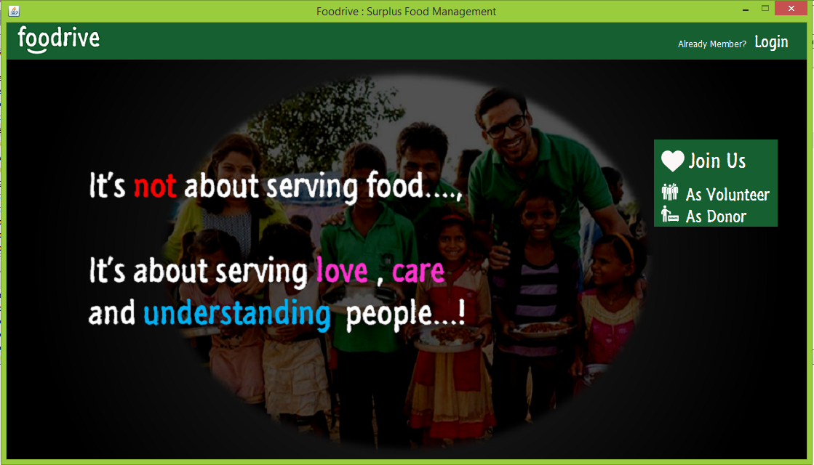
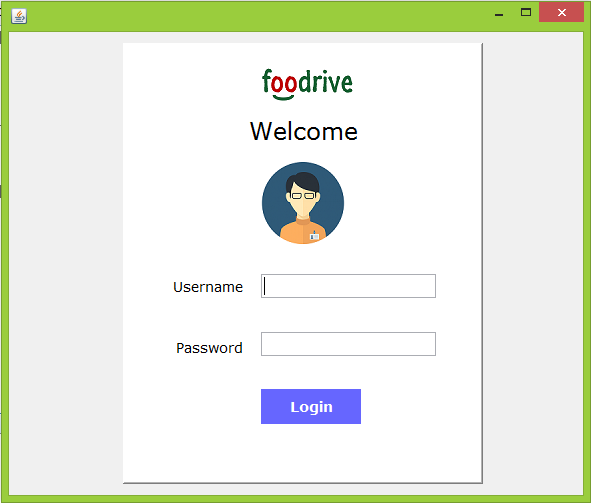
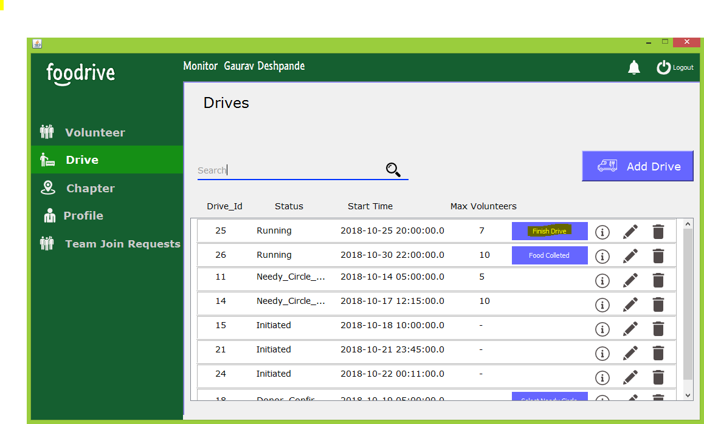
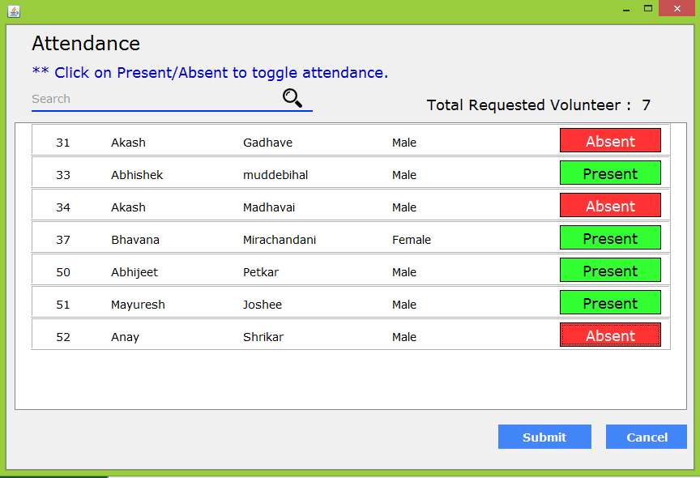

# foodrive

Our solution provides a simple and informative way to connect those who have extra food, and those who need food. Our system will match local restaurants having excess food with local volunteer.

 Even though the world produces enough food to feed twice the world’s present population, food wastage is ironically behind the billions of people who are malnourished. The number of hungry people in India has increased by 65 million more than the population of France. According to a survey by Bhookh (an organization working towards reducing hunger) in 2013, 
 
<ul>
<li> 20 crore Indians sleep hungry on any given night. About 7 million children died in 2012 because of hunger/malnutrition. </li>
<li> Hunger kills more people each year than AIDS, malaria and terrorism combined. </li>
<li> Every 10 seconds, a child dies from hunger. </li>
<li> 82% of hungry people live in countries with food surpluses not food shortages.  </li>
<li> One-third of the food produced around the world is never consumed. </li>
</ul>

The challenge is not a lack of food, it is making food consistently available to everyone who needs it.

Foodrive is a Surplus Food Management System which contribute to overcome food waste problem.

Through Foodrive we provides a simple way to connect those people who have extra food and those peoples who have no food.

 Anyone can be a volunteer in our system like student, advocate, engineers etc.

# Let's take a drive...

  

  

  

  

